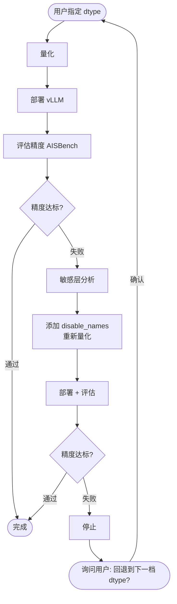

# Quant-Agent — 昇腾 NPU 模型量化 Skill

基于 Claude Code Skill 机制构建的昇腾 NPU 模型量化助手。将专家经验编码为可执行的决策流程，让用户只需描述目标，助手负责选路径、验结果、报失败。

______________________________________________________________________

## 核心工作流



**核心原则**：助手严格遵守用户指定的 dtype，绝不擅自降级。只有评估失败且敏感层分析也无效后，才停下来询问用户是否回退。

______________________________________________________________________

## 工具链覆盖

| 组件 | 功能 | 参考文档 |
|:---|:---|:---|
| **msmodelslim** | 模型量化（W4A8 / W8A8 / W4A4 等） | `msmodelslim-quant.md` |
| **msmodelslim analyze** | 敏感层分析 + 精度恢复 | `msmodelslim-analysis.md` |
| **msmodeling** | 性能仿真 + vLLM 参数调优（TP/DP/Batch） | `msmodeling.md` |
| **vLLM-Ascend** | 量化模型部署与推理 | `vllm-install.md` / `vllm-run.md` |
| **vLLM-Ascend Contribution** | 贡献指南与 DCO 签名要求 | `vllm-contribute.md` |
| **AISBench** | 精度评估（GSM8K 等基准） | `aisbench-install.md` / `aisbench-accuracy.md` |

______________________________________________________________________

## Skill 结构

```
ascend/
├── SKILL.md                      # 入口：硬件检查 + 任务路由
├── msmodelslim-quant.md          # 量化主流程：端到端迭代工作流
├── msmodelslim-analysis.md       # 敏感层分析：精度恢复回退路径
├── vllm-install.md               # vLLM-Ascend 安装
├── vllm-run.md                   # vLLM 部署与调优（Eager → Graph → Serving）
├── vllm-contribute.md            # 贡献指南：DCO 签名与工作流
├── aisbench-install.md           # AISBench 安装
└── aisbench-accuracy.md          # 精度评测：配置、运行、结果排查
```

`SKILL.md` 是唯一入口，其他文件按需加载，保持上下文精简。

______________________________________________________________________

## 支持的量化类型

| dtype | 适用场景 |
|:---|:---|
| `w8a8` | 精度优先，显存充足 |
| `w4a8` | 标准量化，MoE 专家层首选 |
| `w8a16` | 仅权重量化，兼容性最好 |
| `w4a4` | 极限压缩，显存受限场景 |
| `w8a8c8` | KV Cache 同步量化，高吞吐 |

MoE 模型支持混合精度（attention W8A8 + experts W4A8），通过 `group` processor 配置。

______________________________________________________________________

## 设计约定

**每次任务开始前强制执行**：

```bash
npu-smi info # 确认 NPU 健康且无占用进程
```

**所有量化 / 推理命令必须通过 shell 脚本执行并重定向日志**，确保可复现、可 debug：

```bash
./run.sh YOUR_COMMAND 2>&1 | tee run_$(date +%Y%m%d_%H%M%S).log
```

**编码的关键经验规则**（不需要用户了解）：

- `per_token` scope 强制 `symmetric: true`（硬件约束，非偏好）
- `*gate` 路由层在任何配置下均不量化
- SSZ 不支持 `per_group` scope，须改用 `autoround`
- VLM 视觉编码器默认保持 BF16，不纳入量化范围
- 首尾若干层出现精度下降时，优先 exclude 或升回 W8A8，而非降 dtype

______________________________________________________________________

## 自动触发条件

当对话涉及以下关键词时，Skill 自动加载：

- 昇腾 NPU / Ascend / 910B
- vLLM-Ascend / vllm_ascend
- msmodelslim / 模型量化
- W4A8 / W8A8 / W4A4 等量化类型
- AISBench / 精度评测

也可手动调用：`/ascend`
