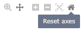
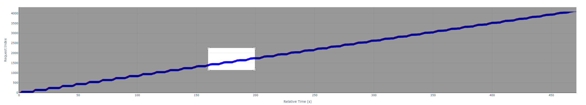
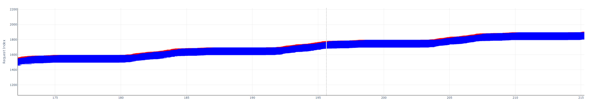
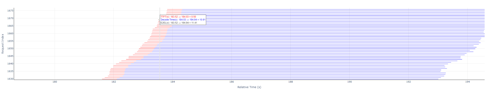
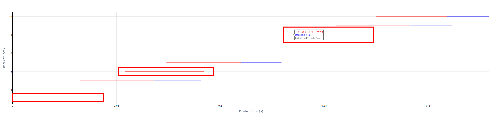
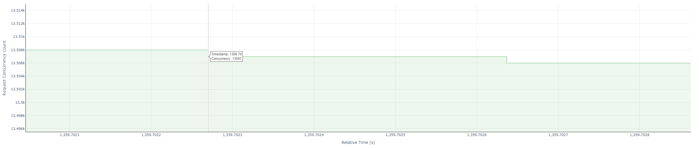

# 性能测试可视化并发图使用说明

> 该并发图用于展示性能测评过程中的详细推理耗时，包括：
>
> - 请求力度耗时展示：每条请求的详细处理耗时，包含Prefill 阶段耗时、Decode 阶段耗时以及请求完整耗时
> - 实时并发数展示：反映测试过程中的并发变化趋势，帮助判断请求调度与系统吞吐能力。
>
> 核心功能
>
> - 精细化耗时分析：可对每条请求的处理过程进行拆解，识别性能瓶颈是否集中在 prefill 或 decode 阶段。
> - 并发动态可视化：展示整个测试期间的并发水平波动，辅助评估系统在高并发压力下的稳定性与响应效率。
> - 支持大规模请求回放：适用于高压测试，分析模型或服务在持续负载下的表现。
>
> 使用场景
>
> - 性能调优：识别瓶颈点，为模型推理服务的延迟优化、并发控制、批量处理策略调整提供数据支持。
> - 推理服务压测验证：对部署后的服务进行压力测试，确保在目标并发场景下性能达标。
> - 部署方案评估：对比不同模型、不同部署方式（如本地 vs 服务化）在相同负载下的响应表现。
>
> 数据生成方式：
> 当以 --mode perf 或 --mode perf_viz 运行性能测试命令时，工具将自动生成一份 HTML 可视化报告。使用任意主流浏览器打开该文件，即可交互式查看每条请求的详细耗时信息和全程并发曲线。

---

## 一、基础交互操作

### 1. 视图控制

> 鼠标滑动至图的右上角可显示导航栏

#### **导航栏说明**

> 从左到右按顺序

| 名称       | 符号              | 作用                                                         | 图例                       |
| ---------- | ----------------- | ------------------------------------------------------------ | ------------------------- |
| Download   | 照相机            | 将当前视图截屏并保存为`png`格式 |  |
| Zoom       | 放大镜            | 开启Zoom模式，详见下表 `鼠标操作说明` 中的 `鼠标拖拽画布` 行 |  |
| Pan        | 正十字            | 开启Pan模式，详见下表 `鼠标操作说明` 中的 `鼠标拖拽画布` 行 |  |
| Zoom in    | 加号              | 以当前视图为中心，等比例同时放大上下两张图                   |  |
| Zoom out   | 减号              | 以当前视图为中心，等比例同时缩小上下两张图                   |  |
| Autoscale  | 斜十字 + 四角外框 | 根据数据规模，重置全图                                       |  |
| Reset axes | 房屋              | 根据初始设置，重置全图                                       |  |

#### **鼠标操作说明**

| 鼠标操作方式     | 图表效果描述                                                 | 对应图标名称 | 图例 |
| ---------------- | ------------------------------------------------------------ | ------------ | ---------------- |
| **滚轮上下滚动** | 图中：放缩光标悬停处的图显示范围;  坐标轴：单一维度放缩   | Zoom         | |
| **左键双击区域** | 重置为默认视图                                               | Autoscale    | |
| **左键拖拽画布** | Zoom模式：选中导航栏中的Zoom按钮后，可放大鼠标拖拽选中的矩形区域;  Pan模式：选中导航栏中的Pan按钮后，可跟随鼠标拖拽来平移图表视角 | Zoom、Pan    | Zoom模式：  - 选中:      - 松开鼠标左键后：     Pan模式：无图例   |

### 2. 数据查看
- **参考样例**
  - **全图总览**
  

  - **请求线段图**
    - 带Decode阶段图例
  
    - 不带Decode阶段图例
  
  - **并发阶梯图**
  

- **图例说明与计算**
  - 请求线段图
    - 每条水平线段：由红、蓝两部分，或只由红色部分组成，表示一条请求的E2EL
    - 红色线段：TTFT，即首Token时延
    - 蓝色线段：Decode, 即非首Token时延
    - 值的计算
      - TTFT = `prefill_latency`
      - Decode = `end_time` - (`start_time` + `prefill_latency`)
      - End-to-End Latency(E2EL) = `end_time` - `start_time`
  - 并发阶梯图
    - 绿色线段：表示随着时间变化而变化的实时请求并发数
    - 值的计算：截取当前时间点的请求数量
- **悬停文本框**
  - 请求线段图：光标悬停在**每条请求线段最开始的数据点**附近，显示：首Token时延(TTFT)、非首Token时延(Decode)、该请求总时长(E2EL)
  - 并发阶梯图：光标悬停在**新事件的转折拐角点**，显示：时间戳（Time）、并发数（Concurrency）
- **坐标轴说明**
  - 请求线段图：
    - 横坐标：相对时间线，起始点：0，单位：s
    - 纵坐标：请求索引，起始点：1
  - 并发阶梯图：
    - 横坐标：相对时间线，起始点：0，单位：s
    - 纵坐标：请求并发个数，起始点：1

---

## 二、高级功能使用

### 多图表联动

> - 两张图的横坐标会同步放缩，而纵坐标由于含义不同故不同步
> - 当单一操作某张图时，如果需要同时参考另一张图中内容，则另一张图的纵坐标和放缩范围需要另外调整，单一维度放缩详见上表 `鼠标操作说明` 中的 `鼠标滚轮滚动` 行

---

## 三、跨平台支持说明

| 使用场景       | 操作方式                                                  |
| -------------- | --------------------------------------------------------- |
| **网页浏览器** | 直接双击HTML文件打开，支持Chrome/Firefox/Edge等主流浏览器 |
| **移动设备**   | 支持触屏手势操作：双指缩放/滑动查看                       |

---

## 四、常见问题解答

| 情况           | 解决方法                                                     |
| -------------- | ------------------------------------------------------------ |
| 图表无法加载   | 确认浏览器启用JavaScript和WebGL，若仍无法加载，可尝试关闭代理       |
| 悬停提示不显示 | 鼠标悬停至时间变化处的数据点而非快速划过或停留在旧事件转折角处 |
| 视图卡顿       | 降低数据密度或缩小视图范围                                   |
| 移动设备操作   | 双指捏合缩放+单指滑动调整                                    |

> - 所有交互功能无需额外按钮
> - 操作状态栏显示在图表右上角
> - 图表完全兼容主流浏览器Chrome/Firefox/Edge最新版
