# 请求发送速率(RPS)分布控制及可视化说明

## 背景介绍

在使用AISBench工具进行性能测评场景下，于推理阶段进行发送请求时对发送速率进行波动控制，旨在**模拟真实业务场景中的流量波动，包括突发性流量和持续增长的流量模式**。
**使用方式请参考[文件配置](#文件配置)处描述。**

核心功能包括：

- 模拟突发性流量
  - **目的**：通过对请求发送速率进行动态波动控制，以还原业务高峰期的流量骤升，评估系统应对突发请求的响应能力
  - **方式**：通过 burstiness 参数调整分布形态，从而实现多种数学分布生成请求发送间隔，如 均匀分布、泊松分布、Gamma 分布

- 模拟持续增长流量
  - **目的**：通过模拟业务请求量持续上升的场景，检验系统处理逐步加压的能力
  - **方式**：通过 ramp_up_strategy、ramp_up_start_rps 与 ramp_up_end_rps 参数设置线性或指数增长模式

- 可视化
  - 请求发送前，展示期望的请求发送速率分布
  - 请求发送后，呈现真实发送请求发送速率分布和预期值的差异，确保用户能直观理解流量波动和系统性能。

**压测场景下RPS分布控制功能无效。**

>
> 🔍 用词解读
>
> - **RPS**：请求发送速率，单位为：$请求条数/秒$
> - **突发性**：请求流量高峰期
> - **爬升**、**爬升行为**：指代请求发送速率从一个起始速率按照特定的方式**增长**到终止速率的行为
> - 公式中，**`burstiness`将简化为$\beta$**
>

---

## 参数详解

### 文件配置

在对应的 🔗 [Model api配置文件](models.md)中，配置以下参数项即可启用功能：

```python

models = [
    dict(
        ... # 其他参数
        request_rate = 100,     # 已有的参数
        traffic_cfg = dict(       # 新增的 traffic_cfg 参数项
            burstiness = 0.5,
            ramp_up_strategy = "linear",
            ramp_up_start_rps = 10,
            ramp_up_end_rps = 200,
        ),
        ... # 其他参数
    )
]

```

> 以上数值仅供参考，使用时请遵循[参数解读](#参数解读)章节表格中的`参数含义`和`参数规则`进行配置

### 参数解读

> `爬升`和`爬升行为`的定义请参考 [背景介绍.用词解读](#背景介绍)

| **参数名称** | **参数含义** | **处理逻辑** |
| ----------- | ----------- | ------------ |
| **burstiness** | 突发性因子($\beta$)，即Gamma分布的形状参数 <br /> 可与`ramp_up_*`三个影响爬升行为的参数协同影响请求发送速率的分布情况 | 该项赋值为`None`、`""`时，均视作**不启用**突变行为 <br /> 取值范围为非负数值（**其它值将被视作异常**）<br /><br /> `burstiness = 0`（或赋值为`None`、`""`）：无突发性（默认值）<br /> `burstiness ∈ (0, 1)`：Gamma分布（高突发性）   <br /> `burstiness = 1`：泊松分布   <br /> `burstiness > 1`：均匀分布（低突发性）<br /><br /> 在request_rate生效或爬升行为生效的情况下才会影响所有请求间隔分布 <br /> 该项配置不同数值时的突变性差异可视化样例请参考 📚 [burstiness](#burstiness) |
| **ramp_up_strategy**  | RPS增长时的方式 | 该项赋值为`None`、`""`时，均视作**不启用**爬升行为 <br /> 当该项赋值为`"linear"`或`"exponential"`，则启用爬升行为。(**其它值将被视作异常**) <br /><br /> 请求发送速率增长计算公式：   <br /> **线性增长(赋值为`linear`)**：$RPS_{current} = RPS_{start} + (RPS_{end} - RPS_{start})×进度$ <br /> **指数增长(赋值为`exponential`)**：$RPS_{current} = RPS_{start} × (增长比例)^{进度}$ |
| **ramp_up_start_rps** | RPS增长时的起始值 | 该项赋值为`None`、`""`时，均视作**不启用**爬升行为 <br /> 取值范围为非负数值（**其它值将被视作异常**）。<br /><br /> 必须与`ramp_up_strategy`和`ramp_up_end_rps`配合使用。<br /> 不满足$ramp\_up\_end\_rps ≥ ramp\_up\_start\_rps$时，视为禁用爬升行为 <br /> 若启用爬升行为，则作为开始时的请求发送速率（$请求条数/秒$），即`起始速率` |
| **ramp_up_end_rps**   | RPS增长时的终止值 | 该项赋值为`None`、`""`时，均视作**不启用**爬升行为 <br /> 取值范围为非负数值（**其它值将被视作异常**）。<br /><br /> 必须与`ramp_up_strategy`和`ramp_up_start_rps`配合使用。<br /> 不满足$ramp\_up\_end\_rps ≥ ramp\_up\_start\_rps$时，视为禁用爬升行为 <br /> 若启用爬升行为，则作为结束时的请求发送速率（$请求条数/秒$），即`目标速率` |

> **表格摘要**
>
> - **控制爬升行为的三个参数**：`ramp_up_strategy`(请求发送速率增长方式：`"linear"`(线性)或`"exponential"`(指数))，`ramp_up_start_rps`(请求发送速率增长时的起始速率)，`ramp_up_end_rps`(请求发送速率增长时的终止速率)
> - **控制突发波动性的参数**：`burstiness`(控制流量突发性的波动因子：($=0$:无突发)，($0<burstiness<1$:突发密集，Gamma分布)，($burstiness=1$:突发性呈泊松分布)，($burstiness>1$:突发性更均匀，相对均匀分布))
> - **约束关系**
>   - 启用爬升行为需**同时满足**以下两点，否则爬升行为不生效:
>     - `ramp_up_strategy`为`"linear"`或`"exponential"`
>     - $ramp\_up\_start\_rps > 0$ 且 $ramp\_up\_end\_rps > 0.1$ 且 $ramp\_up\_end\_rps ≥ ramp\_up\_start\_rps$
> - **目标速率**
>   - **定义**：最终期望的请求发送速率
>   - **用词详解**
>     - `"最终"`: 代表期望达到的发送速率
>     - `"期望"`: 由于受到突发性因子参数、并发数、服务化处理速率等多种因素的影响，此处得到的请求发送速率均为预设值，而非真实值 (`真实发送速率`请参考 📚 [真实请求发送速率图](#可视化-datasetname_rps_distribution_plot_with_actual_rpshtml)中的表述)
>   - **判断规则**
>     - 当启用爬升行为时，`request_rate`不再起作用，而由`ramp_up_end_rps`作为`目标速率`；
>     - 反之，不启用爬升行为时，`request_rate`将作为`目标速率`；
>   - **瞬发场景**：$目标速率 < 0.1$时，**所有请求的发送速率视为瞬发**
>

---

## 可视化: {datasetname}_rps_distribution_plot.html

### 简介

在$目标速率 ≥ 0.1$时（`目标速率`定义请参考[`参数解读.表格摘要.目标速率`](#参数解读)），该可视化文件落盘于：

- 性能测评：`output/default/{时间戳}/performances/{model_api名称}/`

>
> **特殊说明**
>
> - 该图产生于`infer`阶段的`请求发送`前，计算的数据均为**预期的请求发送速率**
> - 当为瞬发场景时($目标速率 < 0.1$)，该文件的三个图无参考意义，**此时不产生该可视化文件**
> - *精度测评场景下不进行可视化*

### 图表内容详解

示例如下：

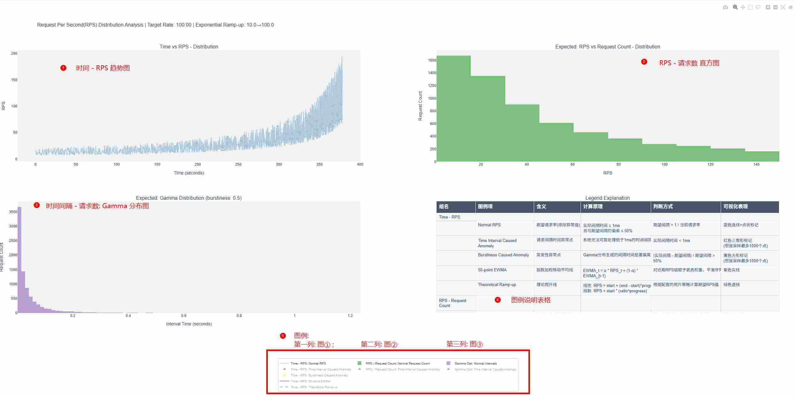

> 操作方式请参考 🔗 [基础交互操作-视图控制](performance_visualization.md#1-视图控制)

#### 1. 时间序列 vs RPS 图（`Time vs RPS - Distribution`）

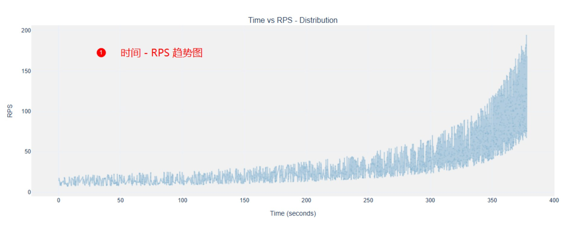

- **X 轴**：时间（秒）。
- **Y 轴**：每秒请求数（RPS）。
- **包含轨迹**：

  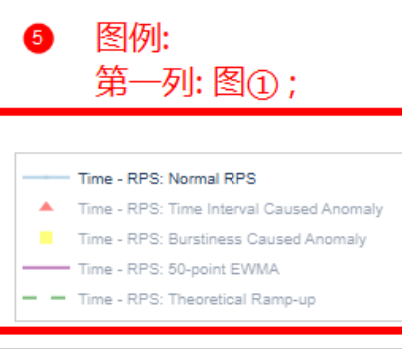

  - **Normal RPS**（蓝色连线）：
    - **判断逻辑**：请求间隔时间 $t_{\text{interval}} \geq 1\text{ms}$ 且 $\frac{|t_{\text{actual}} - t_{\text{expected}}|}{t_{\text{expected}}} \leq 0.5$
    - **期望间隔计算**：$t_{\text{expected}} = \frac{1}{\text{RPS}_{\text{current}}}$
    - **数据来源**：通过 Gamma 分布（当 $\beta > 0$）或固定间隔（当 $\beta = 0$）生成的请求间隔时间

  - **Time Interval Caused Anomaly**（红色三角）：
    - **判断逻辑**：即`时间间隔过短`，筛选条件为：$t_{\text{actual}} < 0.001$ 秒
    - **产生原因**：由突发性因子`burstiness`造成过小的时间间隔，系统无法可靠处理低于 $1\text{ms}$ 的时间间隔从而计算出超高请求发送速率
    - **排除条件**：当 $\beta = 0$ 时不会产生此类异常
    - **优先级**：高于突发性异常，当同时满足`时间间隔过短`和`突发性异常影响过大`两种异常条件时优先标记为此类
    - **特殊处理**：超过1000条数据时，根据时间点，对数据做CDF密度采样处理，仅呈现变化趋势

  - **Burstiness Caused Anomaly**（黄色方块）：
    - **判断逻辑**：即`突发性异常影响过大`，筛选条件为：$\frac{|t_{\text{actual}} - t_{\text{expected}}|}{t_{\text{expected}}} > 0.5$
    - **产生原因**：由突发性因子`burstiness`造成，Gamma 分布生成的突发性间隔时间显著偏离期望值
    - **排除条件**：当 $\beta = 0$ 时不会产生此类异常
    - **特殊处理**：超过1000条数据时，根据时间点，对数据做CDF密度采样处理，仅呈现变化趋势

  - **N-point EWMA**（紫色线）：
    - **计算原理**：指数加权移动平均 $\text{EWMA}_t = \alpha \cdot \text{RPS}_t + (1-\alpha) \cdot \text{EWMA}_{t-1}$
      - 其中 $\alpha = \frac{2}{N+1}$，$N$ 为自适应窗口大小（数据数量阈值:窗口大小：`1000:20`, `10000:50`, `100000:100`, `更大:200`）
    - **作用**：对窗口大小内的时间点对应的RPS求加权平均值，移动窗口从而进行去除噪音值，形成`Normal RPS`的去噪拟合线。对近期 RPS 值赋予更高权重，平滑序列以观察趋势

  - **Theoretical Ramp-up**（绿色虚线）：
    - **计算原理**：
      - 线性爬升：$\text{RPS} = R_{\text{start}} + (R_{\text{end}} - R_{\text{start}}) \times \text{progress}$
      - 指数爬升：$\text{RPS} = R_{\text{start}} \times \left(\frac{R_{end}}{R_{start}}\right)^{progress}$
      - 其中 $\text{progress} = \frac{i}{N-1}$，$i$ 为请求索引，$N$ 为总请求数
    - **前提条件**：需要配置有效的、影响爬升行为相关的三个参数（`ramp_up_strategy`, `ramp_up_start_rps`, `ramp_up_end_rps`）

#### 2. 经典 RPS 分布图（`Expected: RPS vs Request Count - Distribution`）

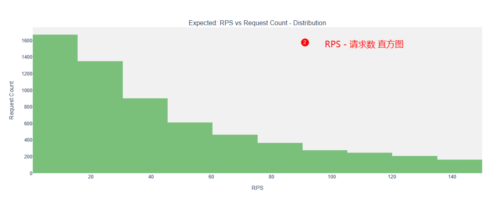

- **X 轴**：RPS 值。
- **Y 轴**：请求计数（落入该 RPS 区间的请求数量）。
- **包含轨迹**：

  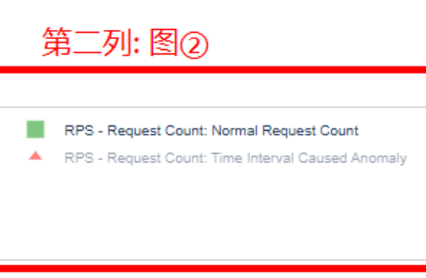

  - **Normal Request Count**（绿色直方图）：
    - **判断逻辑**：同时间序列图中的正常点
    - **特殊处理**：为展示突发性因子参数`burstiness`的作用，突发性异常值在此图中被视为正常值

  - **Time Interval Caused Anomaly**（红色三角）：
    - **判断逻辑**：$t_{\text{actual}} < 0.001$ 秒
    - **分布特征**：通常出现在 RPS 极高的区域（因为 $\text{RPS} = \frac{1}{t_{\text{interval}}}$，所以 $t_{\text{interval}}$ 越小，RPS 越大）

#### 3. 请求间隔时间分布图（`Expected: Gamma Distribution (burstiness: {burstiness})`）

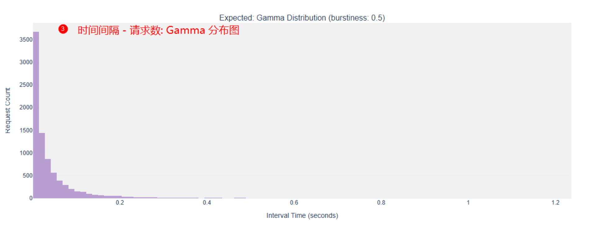

- **X 轴**：请求间隔时间（秒）。
- **Y 轴**：请求计数（落入该时间区间的请求数量）。
- **包含轨迹**：

  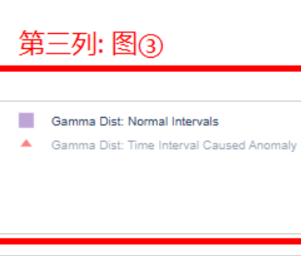

  - **Normal Intervals**（紫色直方图）：
    - **判断逻辑**：$t_{\text{interval}} \geq 0.001$ 且 $\frac{|t_{\text{actual}} - t_{\text{expected}}|}{t_{\text{expected}}} \leq 0.5$
    - **分布形态**：当 $\beta > 0$ 时呈现 Gamma 分布形态
    - **特殊处理**：为展示突发性因子参数`burstiness`的作用，突发性异常值在此图中被视为正常值

  - **Time Interval Caused Anomaly**（红色三角）：
    - **判断逻辑**：$t_{\text{interval}} < 0.001$ 秒
    - **位置特征**：集中在 X 轴最左侧（接近 0 的区域）

#### 4. 图例说明表格（`Legend Explanation`）

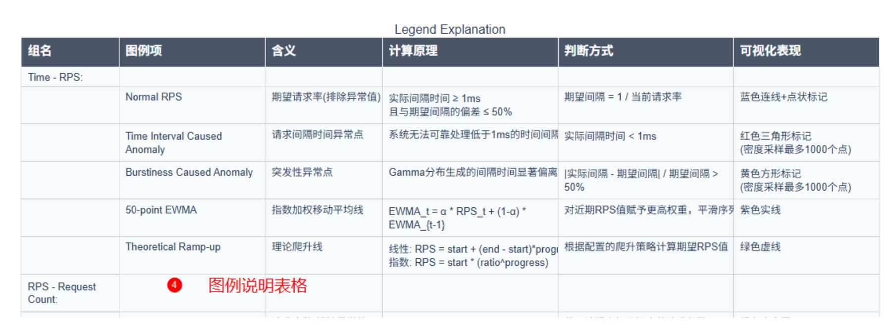

- **内容**：
  - 详细解释每个图表中出现的图例项（轨迹）的含义、计算原理、判断方式和可视化表现
  - 表格结构包含6列：组名、图例项、含义、计算原理、判断方式、可视化表现
- **作用**：帮助理解图表中各种轨迹所代表的含义，确保图表的解读准确性和一致性

#### 5. 图例

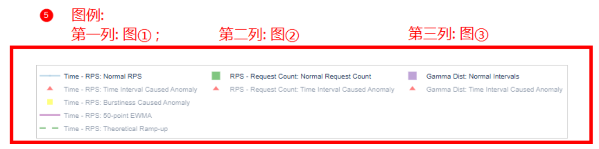

- **内容**：
  - 按**列**区分图例轨迹控制
  - 每个图例的格式为：`图例样式 组名 图例项`
- **作用**：控制每个图表中的轨迹展示(单击图例进行开关轨迹展示)，从而增强图表可读性

---

### 异常点详解

>
> - 此处对`异常点`的排除仅为提高可视化图示的可读性，故对异常数据点进行分类与处理
> - 即，在全局进行请求发送速率控制时，为保留模拟真实的突发性，仍保留这些异常数值
>

#### 时间间隔异常（红色三角）

- **核心条件**：$t_{\text{interval}} < 0.001$
- **产生场景**：
  1. 高 RPS 场景下，即使按计划发送请求也可能产生极短间隔
  2. 爬升行为结束时（特别是指数爬升）可能出现瞬间高负载
  3. 多进程调度冲突导致请求堆积后突发发送
- **处理优先级**：高于突发性异常，两者重叠时优先标记为定时异常

#### 突发性异常（黄色方块）

- **核心条件**：$\frac{|t_{\text{actual}} - t_{\text{expected}}|}{t_{\text{expected}}} > 0.5$

- **产生机制**：

  - 当 $\beta > 0$ 时，通过 Gamma 分布生成间隔时间：

    $t_{\text{interval}} \sim \Gamma(\beta, \theta)$

    其中尺度参数 $\theta = \frac{1}{\lambda \cdot \beta}$，$\lambda$ 为当前请求率

  - $\beta$ 参数控制分布形态：

    - $\beta = 1$：泊松分布
    - $\beta > 1$：均匀分布 (也会产生突发性值，但请求发送速率相对更均匀)
    - $0 < \beta < 1$：Gamma分布（更多极端值）

- **特殊处理**：当 $\beta = 0$ 时，使用固定间隔 $t_{\text{interval}} = \frac{1}{\lambda}$，不会产生此类异常，**$\beta$ 默认为 $0$**

---

### 爬升行为计算公式

#### 两种爬升方式

##### 线性爬升

$\lambda_i = \lambda_{\text{start}} + (\lambda_{\text{end}} - \lambda_{\text{start}}) \times \frac{i}{N-1}$

其中 $i$ 是请求索引（0 到 N-1），$N$ 是总请求数

##### 指数爬升

$\lambda_i = \lambda_{\text{start}} \times \left(\frac{\lambda_{end}}{\lambda_{start}} \right)^{\frac{i}{N-1}}$

### 全局RPS - 全局请求偏移发送时间

1. **时间偏移计算**：

   - 主进程计算全局累积延迟：

     $t_{cumulative, i} = \sum_{k=0}^{i} t_{interval, k}$

   - 各工作进程根据偏移量确定请求发送时间

2. **异常检测**：

   - 在生成时间偏移时同步检测异常点：
     - $timing_anomaly = \left\{i \mid t_{\text{interval},i} < 0.001\right\}$
     - $\text{burstiness_anomaly} = \left\{i \mid \frac{|t_{\text{actual}, i} - t_{\text{expected}, i}|}{t_{\text{expected}, i}} > 0.5\right\} \setminus \text{timing_anomaly}$
     - $\setminus$ 为集合差，表示前面的集合**去除**包含在后面集合中的元素

3. **归一化处理**（仅当无爬升行为且 $\beta = 0$ 时）：

   $t_{\text{total}} = \frac{N}{\lambda}$

   $k = \frac{t_{\text{total}}}{t_{\text{cumulative},N-1}}$

   $t_{cumulative, i} \leftarrow k \times t_{cumulative, i}$

   - 确保总时间符合预期请求率
   - 修正爬升行为引入的时间偏差（但注意，当采用爬升行为时，不进行归一化）

---

## 可视化: {datasetname}_rps_distribution_plot_with_actual_rps.html

> - *精度测评场景下不进行可视化*

### 图表示例

**新增部分**
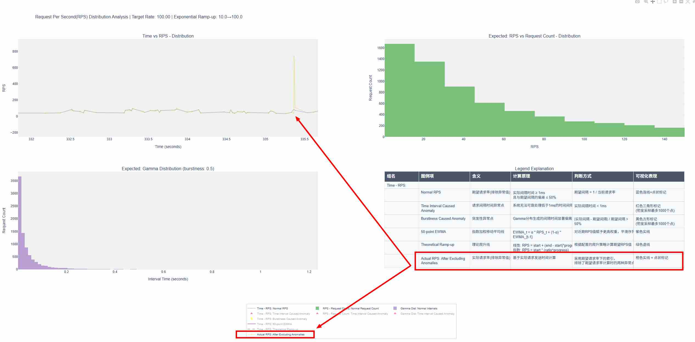

**详细图示**
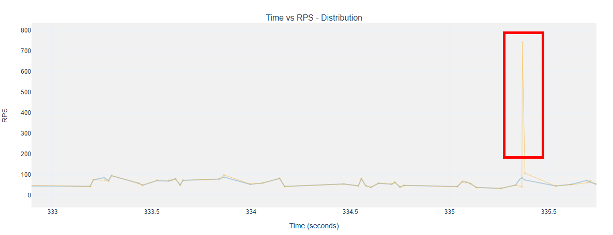
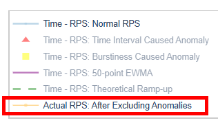
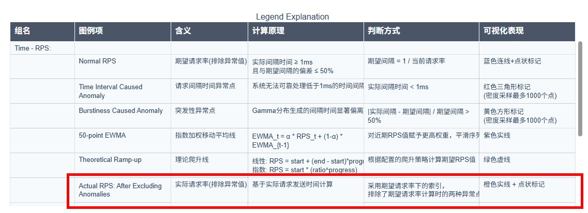

> - 操作方式请参考 🔗 [基础交互操作-视图控制](performance_visualization.md#1-视图控制)
> - 该图产生于`infer`阶段的`推理结束`/`中断等待数据`后，文件落盘位置与`{datasetname}_rps_distribution_plot.html`[预期的文件落盘位置](#简介)相同。

### 图表解读

- 发送请求前产生`{datasetname}_rps_distribution_plot.html`：在该文件原始绘制的`Time vs RPS - Distribution`图中，新增一条橙色轨迹，与原有的蓝色轨迹（预期正常RPS）叠加显示（如上示例呈现的视图红色标记部分）。可通过`Actual RPS: After Excluding Anomalies`图例切换显示/隐藏该轨迹，直观比较真实发送速率和预期发送速率间的差异。
- 发送请求前不产生`{datasetname}_rps_distribution_plot.html`：仅展示真实发送的`Time vs RPS - Distribution`图

### 数据处理

- 数据来源为`每条请求的发送时间点为真实发送时进行的打点`，而数据获取来自`请求发送结束后对发出时间点进行的打点记录`
- 绘制轨迹时，仍然会按照`{datasetname}_rps_distribution_plot.html`中的`Time vs RPS - Distribution`图计算逻辑过滤异常值
- 超过5000条请求时，根据时间点，对数据做CDF密度采样处理，仅为呈现和原始预期RPS变化趋势的区别

---

## 总结

1. 异常点识别基于严格的数学条件（$t_{\text{interval}} < 0.001$ 或 $\frac{\Delta t}{t_{\text{expected}}} > 0.5$）
2. RPS分布形态由`burstiness`、`ramp_up_strategy`、`ramp_up_start_rps`和`ramp_up_end_rps`共同决定
3. 多进程调度中的全局时间偏移计算**是预期的**（即`{datasetname}_rps_distribution_plot.html`的部分），而实际发送速率（即`{datasetname}_rps_distribution_plot_with_actual_rps.html`的新增部分）**会受到并发数、物理机性能、服务化请求处理效率、多轮对话场景等因素而造成偏离预期**的影响
4. **不支持压测场景**
5. **多轮对话场景下，仅第一轮的请求分布有效**

---

## 配置与可视化示例

### `burstiness`

> - 以下示例为配置突发性因子`burstiness`参数为不同值时，对应的`Expected：Gamma Distribution`图
> - 为更直观展现突发性因子造成的请求发送速率波动差异，此处均不启用爬升行为 (即不配置`ramp_up_*`相关参数)

1. `burstiness = 0`

    参数配置:

    ```python
            request_rate = 100,
            traffic_cfg = dict(
                burstiness = 0,
            ),
    ```

    Gamma 分布图:

    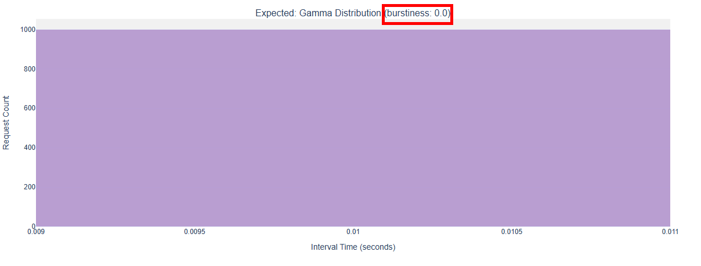

2. `burstiness = 0.5`

    参数配置:

    ```python
            request_rate = 100,
            traffic_cfg = dict(
                burstiness = 0.5,
            ),
    ```

    Gamma 分布图:

    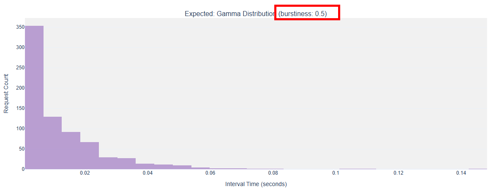

3. `burstiness = 1`

    参数配置:

    ```python
            request_rate = 100,
            traffic_cfg = dict(
                burstiness = 1,
            ),
    ```

    Gamma 分布图:

    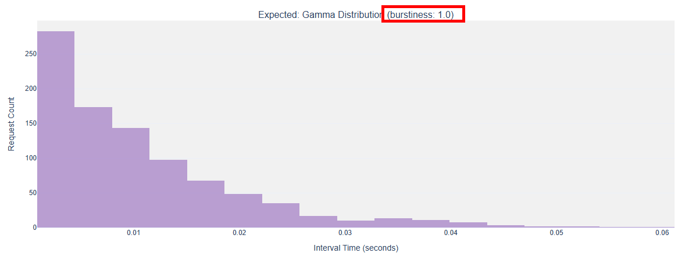

4. `burstiness = 10`

    参数配置:

    ```python
            request_rate = 100,
            traffic_cfg = dict(
                burstiness = 10,
            ),
    ```

    Gamma 分布图:

    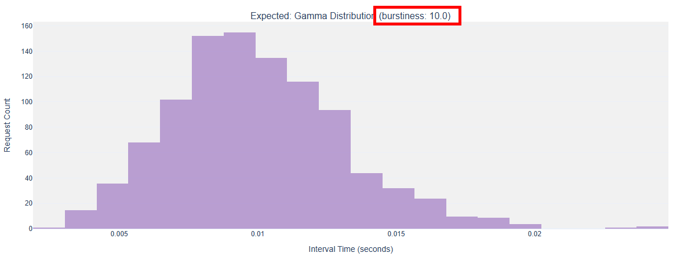
