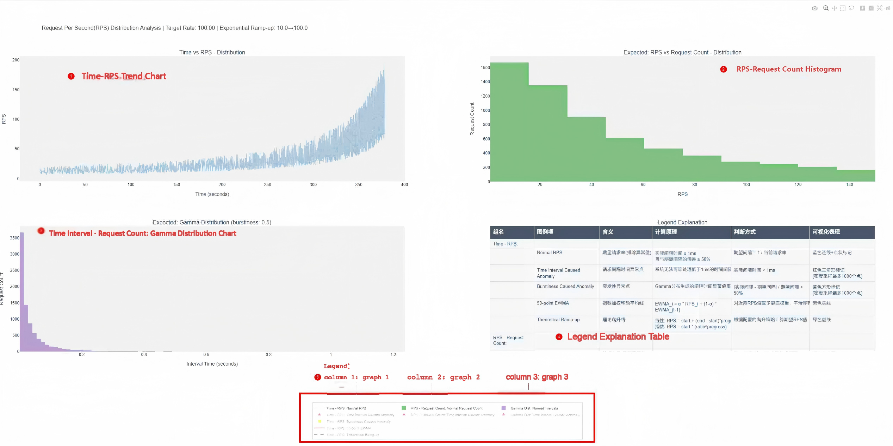
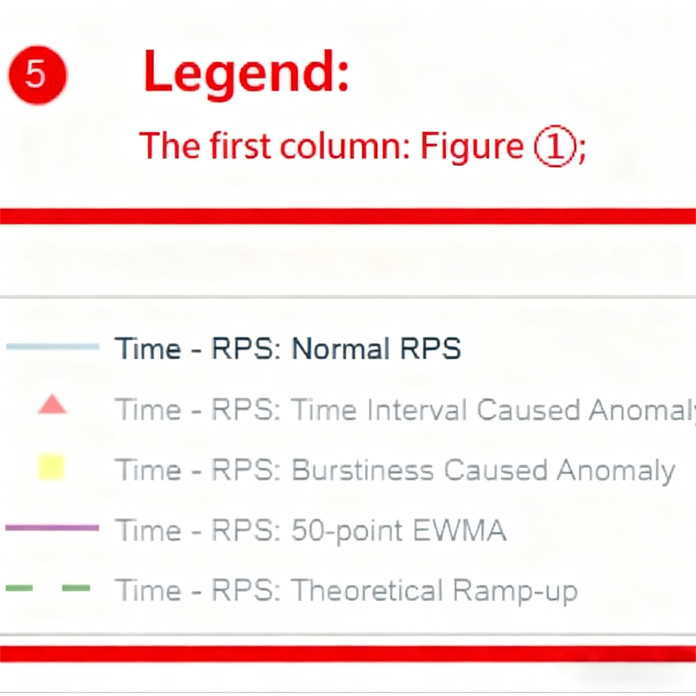
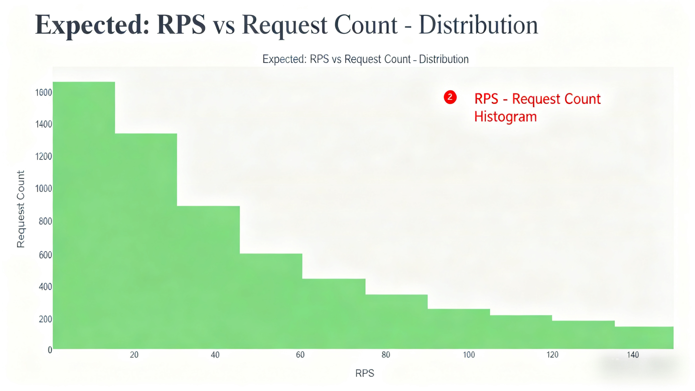
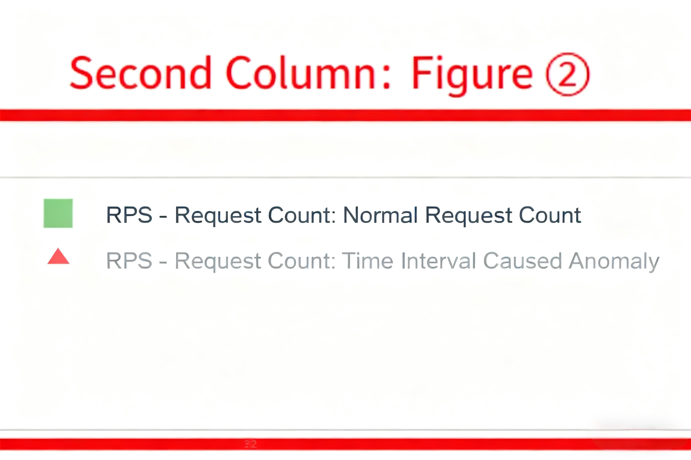
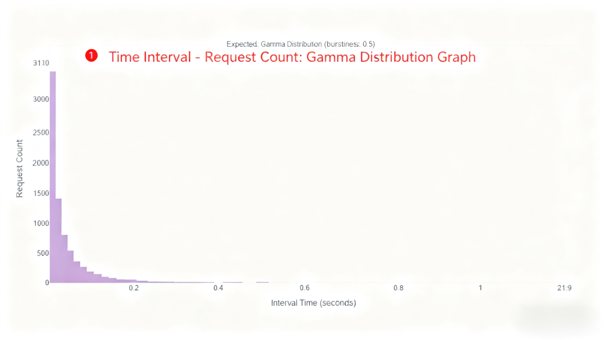
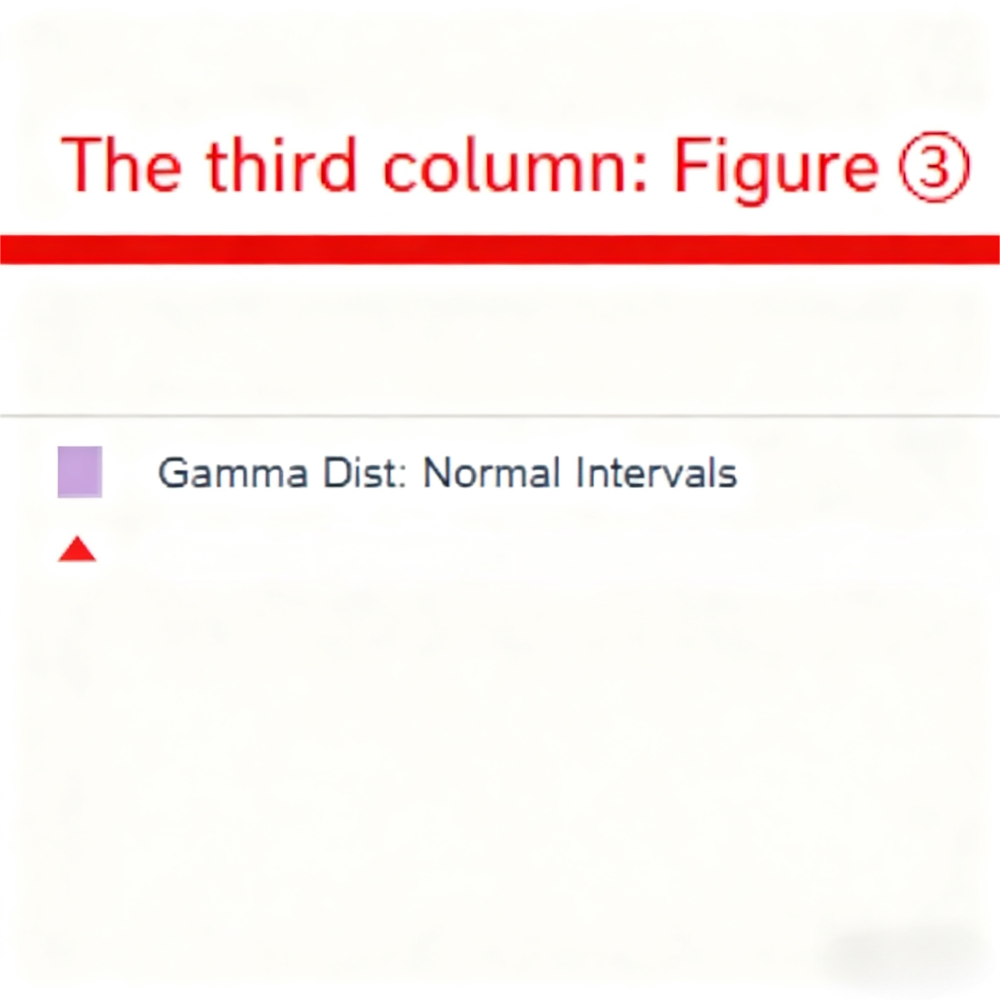
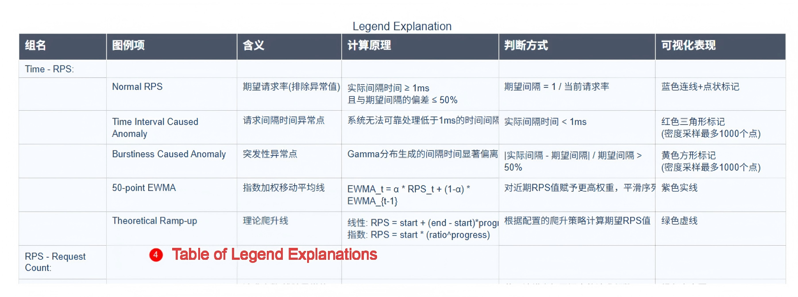
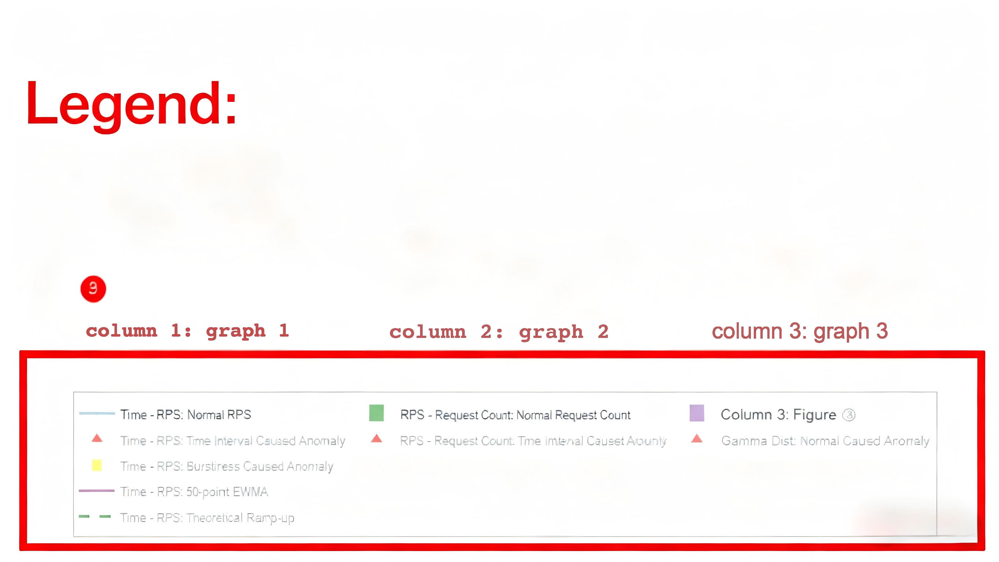
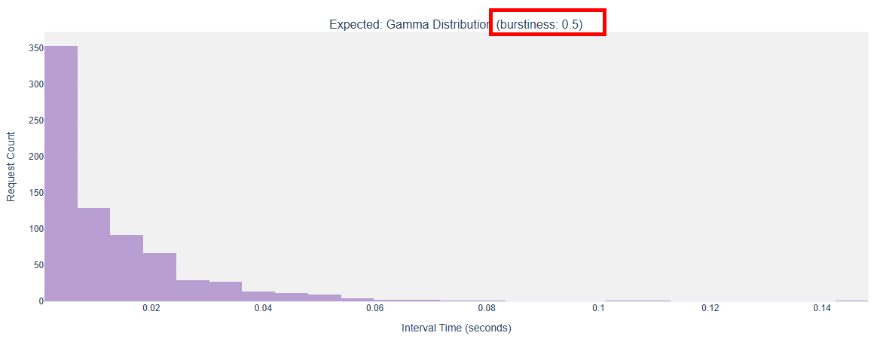
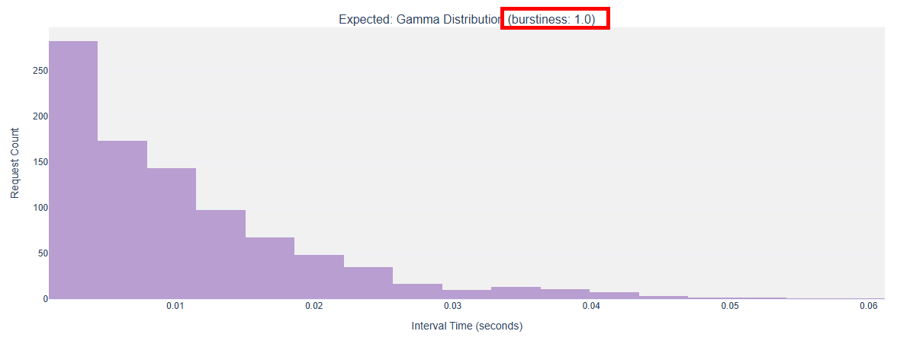

# Request Sending Rate (RPS) Distribution Control and Visualization Guide

## Background Introduction

In performance testing scenarios using the AISBench tool, **fluctuation control of the request sending rate during the inference phase (when sending requests)** is designed to **simulate traffic fluctuations in real-world business scenarios, including bursty traffic and continuously growing traffic patterns**.
For usage instructions, please refer to the description in the [File Configuration](#file-configuration) section.


### Core Features

- **Bursty Traffic Simulation**
  - **Purpose**: Dynamically control fluctuations in the request sending rate to replicate sudden traffic surges during business peak hours, and evaluate the system’s ability to respond to sudden requests.
  - **Method**: Adjust the distribution shape via the `burstiness` parameter to generate request sending intervals using various mathematical distributions, such as uniform distribution, Poisson distribution, and Gamma distribution.

- **Continuously Growing Traffic Simulation**
  - **Purpose**: Simulate scenarios where business request volumes increase steadily to test the system’s ability to handle gradual load escalation.
  - **Method**: Configure linear or exponential growth modes using the `ramp_up_strategy`, `ramp_up_start_rps`, and `ramp_up_end_rps` parameters.

- **Visualization**
  - Before sending requests: Display the expected distribution of the request sending rate.
  - After sending requests: Present the difference between the actual request sending rate distribution and the expected values, allowing users to intuitively understand traffic fluctuations and system performance.


> ⚠️ The RPS distribution control feature is **invalid in stress testing scenarios**.


> 🔍 Terminology Interpretation
> - **RPS**: Request Per Second, unit: $requests/second$.
> - **Burstiness**: Peak periods of request traffic.
> - **Ramp-up** / **Ramp-up Behavior**: The process of the request sending rate **increasing** from a starting rate to an ending rate in a specific manner.
> - In formulas, **`burstiness` is abbreviated as $\beta$**.


---

## Parameter Details

### File Configuration

To enable the feature, configure the following parameters in the corresponding 🔗 [Model API Configuration File](../base_tutorials/all_params/models.md):

```python
models = [
    dict(
        ... # Other parameters
        request_rate = 100,     # Existing parameter
        traffic_cfg = dict(       # Newly added `traffic_cfg` parameter
            burstiness = 0.5,
            ramp_up_strategy = "linear",
            ramp_up_start_rps = 10,
            ramp_up_end_rps = 200,
        ),
        ... # Other parameters
    )
]
```

> The values above are for reference only. When using the feature, configure parameters according to the `Parameter Meaning` and `Parameter Rules` in the table in the [Parameter Interpretation](#parameter-interpretation) section.


### Parameter Interpretation

> For the definitions of "ramp-up" and "ramp-up behavior", please refer to [Background Introduction > Terminology Interpretation](#background-introduction).

| **Parameter Name**       | **Parameter Meaning**                                                                                                                                                                                                 | **Processing Logic**                                                                                                                                                                                                                                                                                                                                 |
|---------------------------|-----------------------------------------------------------------------------------------------------------------------------------------------------------------------------------------------------------------------|-----------------------------------------------------------------------------------------------------------------------------------------------------------------------------------------------------------------------------------------------------------------------------------------------------------------------------------------------------|
| **burstiness**            | Burstiness factor ($\beta$), i.e., the shape parameter of the Gamma distribution. It collaborates with the three `ramp_up_*` parameters (which affect ramp-up behavior) to influence the distribution of the request sending rate.                                                      | - If set to `None` or `""`, burst behavior is **disabled**. <br> - Value range: Non-negative numbers (**other values are considered invalid**). <br> <br> - `burstiness = 0` (or `None`/`""`): No burstiness (default). <br> - `burstiness ∈ (0, 1)`: Gamma distribution (high burstiness). <br> - `burstiness = 1`: Poisson distribution. <br> - `burstiness > 1`: Uniform distribution (low burstiness). <br> <br> - It only affects the distribution of all request intervals if `request_rate` is active or ramp-up behavior is enabled. <br> - For visualization examples of burstiness differences with different parameter values, refer to 📚 [burstiness](#burstiness). |
| **ramp_up_strategy**      | The mode of RPS growth.                                                                                                                                                                                                 | - If set to `None` or `""`, ramp-up behavior is **disabled**. <br> - If set to `"linear"` or `"exponential"`, ramp-up behavior is enabled (**other values are considered invalid**). <br> <br> - Formulas for RPS growth: <br>   - **Linear growth** (set to `"linear"`): $RPS_{current} = RPS_{start} + (RPS_{end} - RPS_{start}) × progress$ <br>   - **Exponential growth** (set to `"exponential"`): $RPS_{current} = RPS_{start} × (growth ratio)^{progress}$                                                                                                                             |
| **ramp_up_start_rps**     | The starting value of RPS during ramp-up.                                                                                                                                                                               | - If set to `None` or `""`, ramp-up behavior is **disabled**. <br> - Value range: Non-negative numbers (**other values are considered invalid**). <br> <br> - Must be used together with `ramp_up_strategy` and `ramp_up_end_rps`. <br> - If $ramp\_up\_end\_rps < ramp\_up\_start\_rps$, ramp-up behavior is disabled. <br> - If ramp-up behavior is enabled, this value serves as the initial request sending rate (in $requests/second$), i.e., the `starting rate`.                                                                 |
| **ramp_up_end_rps**       | The ending value of RPS during ramp-up.                                                                                                                                                                                 | - If set to `None` or `""`, ramp-up behavior is **disabled**. <br> - Value range: Non-negative numbers (**other values are considered invalid**). <br> <br> - Must be used together with `ramp_up_strategy` and `ramp_up_start_rps`. <br> - If $ramp\_up\_end\_rps < ramp\_up\_start\_rps$, ramp-up behavior is disabled. <br> - If ramp-up behavior is enabled, this value serves as the final request sending rate (in $requests/second$), i.e., the `target rate`.                                                                     |


> **Table Summary**
> - **Three parameters controlling ramp-up behavior**: <br>   - `ramp_up_strategy` (RPS growth mode: `"linear"` for linear growth or `"exponential"` for exponential growth), <br>   - `ramp_up_start_rps` (starting RPS during growth), <br>   - `ramp_up_end_rps` (ending RPS during growth). <br> - **Parameter controlling burst fluctuation**: <br>   - `burstiness` (fluctuation factor for traffic burstiness: $=0$ for no burst, $0<burstiness<1$ for dense bursts (Gamma distribution), $burstiness=1$ for Poisson-distributed burstiness, $burstiness>1$ for more uniform burstiness (approximate uniform distribution)). <br> - **Constraint Relationships**: <br>   - Ramp-up behavior is enabled **only if both conditions are met**; otherwise, it is disabled: <br>     1. `ramp_up_strategy` is set to `"linear"` or `"exponential"`. <br>     2. $ramp\_up\_start\_rps > 0$, $ramp\_up\_end\_rps > 0.1$, and $ramp\_up\_end\_rps ≥ ramp\_up\_start\_rps$. <br> - **Target Rate**: <br>   - **Definition**: The final expected request sending rate. <br>   - **Terminology Details**: <br>     - "Final": Refers to the desired sending rate to be achieved. <br>     - "Expected": The request sending rate here is a preset value (not the actual value) due to factors such as the burstiness factor, concurrency, and service processing rate. For the `actual sending rate`, refer to the description in 📚 [Actual Request Sending Rate Chart](#visualization-datasetname_rps_distribution_plot_with_actual_rpshtml). <br>   - **Judgment Rules**: <br>     - If ramp-up behavior is enabled, `request_rate` is no longer effective, and `ramp_up_end_rps` becomes the `target rate`. <br>     - If ramp-up behavior is disabled, `request_rate` serves as the `target rate`. <br>   - **Instantaneous Scenario**: When the `target rate < 0.1`, **all requests are sent at an instantaneous rate**.


---

## Visualization: {datasetname}_rps_distribution_plot.html

### Overview

When the $target rate ≥ 0.1$ (see [Parameter Interpretation > Table Summary > Target Rate](#parameter-interpretation) for the definition of `target rate`), this visualization file is saved to:

- Performance Testing: `output/default/{timestamp}/performances/{model_api_name}/`


> **Special Notes**
> - This chart is generated **before sending requests** during the `infer` phase, and all calculated data represents the **expected request sending rate**.
> - In instantaneous scenarios ($target rate < 0.1$), the three charts in this file have no reference value, so **this visualization file is not generated**.
> - *No visualization is provided for accuracy testing scenarios*.


### Detailed Chart Explanations

An example is shown below:



> For operation methods, refer to 🔗 [Basic Interactive Operations - View Control](../base_tutorials/results_intro/performance_visualization.md#1-view-control).


#### 1. Time vs RPS Chart (`Time vs RPS - Distribution`)


- **X-axis**: Time (seconds).
- **Y-axis**: Requests Per Second (RPS).
- **Included Traces**:

  

  - **Normal RPS** (blue line):
    - **Judgment Logic**: Request interval $t_{\text{interval}} \geq 1\text{ms}$ and $\frac{|t_{\text{actual}} - t_{\text{expected}}|}{t_{\text{expected}}} \leq 0.5$.
    - **Expected Interval Calculation**: $t_{\text{expected}} = \frac{1}{\text{RPS}_{\text{current}}}$.
    - **Data Source**: Request intervals generated via Gamma distribution (when $\beta > 0$) or fixed intervals (when $\beta = 0$).

  - **Time Interval Caused Anomaly** (red triangles):
    - **Judgment Logic**: "Excessively short time intervals", filtered by $t_{\text{actual}} < 0.001$ seconds.
    - **Cause**: The `burstiness` parameter leads to extremely short time intervals; the system cannot reliably handle intervals shorter than $1\text{ms}$, resulting in an abnormally high request sending rate.
    - **Exclusion Condition**: No such anomalies occur when $\beta = 0$.
    - **Priority**: Higher than burstiness-induced anomalies. If both "excessively short time intervals" and "significant burstiness impact" conditions are met, this type of anomaly is marked first.
    - **Special Handling**: If there are more than 1,000 data points, CDF (Cumulative Distribution Function) density sampling is applied based on time to only show the trend.

  - **Burstiness Caused Anomaly** (yellow squares):
    - **Judgment Logic**: "Significant burstiness impact", filtered by $\frac{|t_{\text{actual}} - t_{\text{expected}}|}{t_{\text{expected}}} > 0.5$.
    - **Cause**: Caused by the `burstiness` parameter; burst intervals generated by the Gamma distribution deviate significantly from the expected value.
    - **Exclusion Condition**: No such anomalies occur when $\beta = 0$.
    - **Special Handling**: If there are more than 1,000 data points, CDF density sampling is applied based on time to only show the trend.

  - **N-point EWMA** (purple line):
    - **Calculation Principle**: Exponentially Weighted Moving Average: $\text{EWMA}_t = \alpha \cdot \text{RPS}_t + (1-\alpha) \cdot \text{EWMA}_{t-1}$, where $\alpha = \frac{2}{N+1}$ and $N$ is the adaptive window size (data threshold : window size: `1000:20`, `10000:50`, `100000:100`, `larger:200`).
    - **Purpose**: Calculate the weighted average of RPS values within the window size, and move the window to reduce noise, forming a denoised fitting line for `Normal RPS`. Higher weights are assigned to recent RPS values to smooth the sequence and observe trends.

  - **Theoretical Ramp-up** (green dashed line):
    - **Calculation Principle**:
      - Linear ramp-up: $\text{RPS} = R_{\text{start}} + (R_{\text{end}} - R_{\text{start}}) \times \text{progress}$
      - Exponential ramp-up: $\text{RPS} = R_{\text{start}} \times \left(\frac{R_{end}}{R_{start}}\right)^{progress}$
      - Where $\text{progress} = \frac{i}{N-1}$, $i$ is the request index, and $N$ is the total number of requests.
    - **Prerequisite**: Valid configuration of the three parameters related to ramp-up behavior (`ramp_up_strategy`, `ramp_up_start_rps`, `ramp_up_end_rps`).


#### 2. Classic RPS Distribution Chart (`Expected: RPS vs Request Count - Distribution`)



- **X-axis**: RPS value.
- **Y-axis**: Request count (number of requests falling into the RPS interval).
- **Included Traces**:

  

  - **Normal Request Count** (green histogram):
    - **Judgment Logic**: Same as the normal points in the Time vs RPS Chart.
    - **Special Handling**: To demonstrate the effect of the `burstiness` parameter, burst-induced anomalies are treated as normal values in this chart.

  - **Time Interval Caused Anomaly** (red triangles):
    - **Judgment Logic**: $t_{\text{actual}} < 0.001$ seconds.
    - **Distribution Feature**: Typically appears in regions with extremely high RPS (since $\text{RPS} = \frac{1}{t_{\text{interval}}}$, smaller $t_{\text{interval}}$ leads to larger RPS).


#### 3. Request Interval Distribution Chart (`Expected: Gamma Distribution (burstiness: {burstiness})`)



- **X-axis**: Request interval (seconds).
- **Y-axis**: Request count (number of requests falling into the interval).
- **Included Traces**:

  

  - **Normal Intervals** (purple histogram):
    - **Judgment Logic**: $t_{\text{interval}} \geq 0.001$ and $\frac{|t_{\text{actual}} - t_{\text{expected}}|}{t_{\text{expected}}} \leq 0.5$.
    - **Distribution Shape**: Shows a Gamma distribution shape when $\beta > 0$.
    - **Special Handling**: To demonstrate the effect of the `burstiness` parameter, burst-induced anomalies are treated as normal values in this chart.

  - **Time Interval Caused Anomaly** (red triangles):
    - **Judgment Logic**: $t_{\text{interval}} < 0.001$ seconds.
    - **Position Feature**: Concentrated on the far left of the X-axis (near 0).


#### 4. Legend Explanation Table (`Legend Explanation`)



- **Content**:
  - Detailed explanations of the meaning, calculation principle, judgment method, and visual representation of each legend item (trace) in the charts.
  - The table includes 6 columns: Group Name, Legend Item, Meaning, Calculation Principle, Judgment Method, and Visual Representation.
- **Purpose**: Help users understand the meaning of each trace in the charts, ensuring accurate and consistent interpretation.


#### 5. Legend



- **Content**:
  - Trace controls for the legend are distinguished by **columns**.
  - The format of each legend item is: `Legend Style | Group Name | Legend Item`
- **Function**: Controls the display of traces in each chart (click a legend item to show/hide the corresponding trace), thereby improving the readability of the charts.


---

### Detailed Explanation of Anomaly Points

>
> - The exclusion of `anomaly points` here is solely to improve the readability of visualization charts, so anomalous data points are classified and processed accordingly.
> - That is, during global request sending rate control, these anomalous values are still retained to simulate real-world burstiness.
>

#### Time Interval Anomalies (Red Triangles)

- **Core Condition**: $t_{\text{interval}} < 0.001$
- **Occurrence Scenarios**:
  1. In high-RPS scenarios, extremely short intervals may occur even when requests are sent as scheduled.
  2. Instantaneous high load may appear at the end of ramp-up behavior (especially for exponential ramp-up).
  3. Multi-process scheduling conflicts cause request backlogs, leading to bursty sending of accumulated requests.
- **Processing Priority**: Higher than burstiness-induced anomalies. If both types of anomalies overlap, the point is marked as a time interval anomaly first.


#### Burstiness-Induced Anomalies (Yellow Squares)

- **Core Condition**: $\frac{|t_{\text{actual}} - t_{\text{expected}}|}{t_{\text{expected}}} > 0.5$

- **Generation Mechanism**:

  - When $\beta > 0$, interval times are generated via the Gamma distribution:

    $t_{\text{interval}} \sim \Gamma(\beta, \theta)$

    where the scale parameter $\theta = \frac{1}{\lambda \cdot \beta}$, and $\lambda$ is the current request rate.

  - The $\beta$ parameter controls the distribution shape:

    - $\beta = 1$: Poisson distribution
    - $\beta > 1$: Uniform distribution (bursty values may still occur, but the request sending rate is relatively more uniform)
    - $0 < \beta < 1$: Gamma distribution (more extreme values)

- **Special Handling**: When $\beta = 0$, a fixed interval $t_{\text{interval}} = \frac{1}{\lambda}$ is used, and no such anomalies occur. **The default value of $\beta$ is 0**.


---

### Calculation Formulas for Ramp-Up Behavior

#### Two Ramp-Up Modes

##### Linear Ramp-Up

$\lambda_i = \lambda_{\text{start}} + (\lambda_{\text{end}} - \lambda_{\text{start}}) \times \frac{i}{N-1}$

where $i$ is the request index (ranging from 0 to N-1), and $N$ is the total number of requests.

##### Exponential Ramp-Up

$\lambda_i = \lambda_{\text{start}} \times \left(\frac{\lambda_{end}}{\lambda_{start}} \right)^{\frac{i}{N-1}}$


### Global RPS - Global Request Offset Sending Time

1. **Time Offset Calculation**:

   - The main process calculates the global cumulative delay:

     $t_{cumulative, i} = \sum_{k=0}^{i} t_{interval, k}$

   - Each worker process determines the request sending time based on the offset.

2. **Anomaly Detection**:

   - Anomaly points are detected synchronously when generating time offsets:
     - $timing_anomaly = \left\{i \mid t_{\text{interval},i} < 0.001\right\}$
     - $\text{burstiness_anomaly} = \left\{i \mid \frac{|t_{\text{actual}, i} - t_{\text{expected}, i}|}{t_{\text{expected}, i}} > 0.5\right\} \setminus \text{timing_anomaly}$
     - $\setminus$ denotes the set difference, meaning elements in the former set that are **not present** in the latter set are retained.

3. **Normalization Processing** (only when there is no ramp-up behavior and $\beta = 0$):

   $t_{\text{total}} = \frac{N}{\lambda}$

   $k = \frac{t_{\text{total}}}{t_{\text{cumulative},N-1}}$

   $t_{cumulative, i} \leftarrow k \times t_{cumulative, i}$

   - Ensures the total time matches the expected request rate.
   - Corrects time deviations introduced by ramp-up behavior (note: normalization is not performed when ramp-up behavior is enabled).


---

## Visualization: {datasetname}_rps_distribution_plot_with_actual_rps.html

> - *No visualization is provided for accuracy testing scenarios*.

### Chart Example

**Newly Added Part**


**Detailed Diagrams**


> - For operation methods, refer to the link 🔗 [Basic Interactive Operations - View Control](../base_tutorials/results_intro/performance_visualization.md#1-view-control)
> - This chart is generated after the `inference completion`/`interruption and data waiting` phase of the `infer` stage. It is saved to the same location as the [expected save path](#overview) of `{datasetname}_rps_distribution_plot.html`.


### Chart Interpretation

- If `{datasetname}_rps_distribution_plot.html` is generated before sending requests: A new orange trace is added to the original `Time vs RPS - Distribution` chart in this file, overlapping with the existing blue trace (expected normal RPS) (as shown in the red-marked part of the example above). You can toggle the display/hide of this trace via the `Actual RPS: After Excluding Anomalies` legend to intuitively compare the difference between the actual sending rate and the expected sending rate.
- If `{datasetname}_rps_distribution_plot.html` is not generated before sending requests: Only the `Time vs RPS - Distribution` chart of the actual sent requests is displayed.


### Data Processing

- **Data Source**: The sending timestamp of each request is recorded when the request is actually sent; the data is obtained from the timestamp records collected after all requests are sent.
- When drawing the trace, anomalous values are still filtered out according to the calculation logic of the `Time vs RPS - Distribution` chart in `{datasetname}_rps_distribution_plot.html`.
- If there are more than 5,000 requests, CDF (Cumulative Distribution Function) density sampling is applied based on time to only highlight the difference in variation trends between the actual RPS and the original expected RPS.


---

## Summary

1. Anomaly points are identified based on strict mathematical conditions ($t_{\text{interval}} < 0.001$ or $\frac{\Delta t}{t_{\text{expected}}} > 0.5$).
2. The shape of the RPS distribution is jointly determined by `burstiness`, `ramp_up_strategy`, `ramp_up_start_rps`, and `ramp_up_end_rps`.
3. The calculation of global time offsets in multi-process scheduling is **expected** (i.e., the content of `{datasetname}_rps_distribution_plot.html`), while the actual sending rate (i.e., the newly added part of `{datasetname}_rps_distribution_plot_with_actual_rps.html`) may **deviate from expectations** due to factors such as concurrency, physical machine performance, service request processing efficiency, and multi-turn dialogue scenarios.
4. **Stress testing scenarios are not supported**.
5. **In multi-turn dialogue scenarios, only the request distribution of the first turn is valid**.


---

## Configuration and Visualization Examples

### `burstiness`

> - The following examples show the `Expected: Gamma Distribution` charts when the burstiness factor `burstiness` is configured with different values.
> - To more intuitively demonstrate the differences in request sending rate fluctuations caused by the burstiness factor, ramp-up behavior is disabled (i.e., no `ramp_up_*` parameters are configured) in all examples.

1. `burstiness = 0`

    Parameter Configuration:

    ```python
            request_rate = 100,
            traffic_cfg = dict(
                burstiness = 0,
            ),
    ```

    Gamma Distribution Chart:

    

2. `burstiness = 0.5`

    Parameter Configuration:

    ```python
            request_rate = 100,
            traffic_cfg = dict(
                burstiness = 0.5,
            ),
    ```

    Gamma Distribution Chart:

    

3. `burstiness = 1`

    Parameter Configuration:

    ```python
            request_rate = 100,
            traffic_cfg = dict(
                burstiness = 1,
            ),
    ```

    Gamma Distribution Chart:

    

4. `burstiness = 10`

    Parameter Configuration:

    ```python
            request_rate = 100,
            traffic_cfg = dict(
                burstiness = 10,
            ),
    ```

    Gamma Distribution Chart:

    