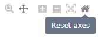
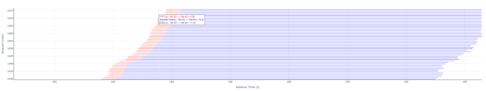
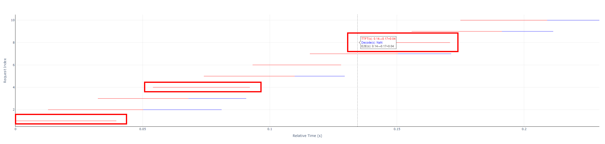

# User Guide for Performance Test Visualization Concurrency Chart

> This concurrency chart is used to display detailed inference time consumption during performance evaluation, including:
> - Request-level time consumption display: Detailed processing time for each request, including Prefill stage time consumption, Decode stage time consumption, and total request time consumption.
> - Real-time concurrency display: Reflects the trend of concurrency changes during the test, helping to evaluate request scheduling and system throughput capabilities.
>
> Core Functions
> - Granular time consumption analysis: Disassembles the processing process of each request to identify whether performance bottlenecks are concentrated in the Prefill or Decode stage.
> - Dynamic concurrency visualization: Displays fluctuations in concurrency levels throughout the test, assisting in evaluating the stability and response efficiency of the system under high concurrency pressure.
> - Support for large-scale request replay: Suitable for high-pressure testing to analyze the performance of models or services under sustained load.
>
> Application Scenarios
> - Performance optimization: Identifies bottlenecks and provides data support for latency optimization of model inference services, concurrency control, and adjustment of batch processing strategies.
> - Inference service stress test verification: Conducts stress tests on deployed services to ensure performance meets standards under target concurrency scenarios.
> - Deployment solution evaluation: Compares the response performance of different models and deployment methods (e.g., local vs. service-oriented) under the same load.
>
> Data Generation Method:
> When running the performance test command with `--mode perf` or `--mode perf_viz`, the tool will automatically generate an HTML visualization report. Open this file with any mainstream browser to interactively view the detailed time consumption information of each request and the full-process concurrency curve.

---

## I. Basic Interactive Operations

### 1. View Control

> Hover the mouse over the top-right corner of the chart to display the navigation bar.

#### **Navigation Bar Description**

> From left to right in order

| Name       | Icon              | Function                                                         | Legend                       |
| ---------- | ----------------- | ------------------------------------------------------------ | ------------------------- |
| Download   | Camera            | Captures the current view and saves it in `png` format |  |
| Zoom       | Magnifying glass   | Enables Zoom mode; see the "Mouse drag canvas" row in the "Mouse Operation Description" table below |  |
| Pan        | Crosshair         | Enables Pan mode; see the "Mouse drag canvas" row in the "Mouse Operation Description" table below |  |
| Zoom in    | Plus sign         | Zooms in both the upper and lower charts proportionally with the current view as the center |  |
| Zoom out   | Minus sign        | Zooms out both the upper and lower charts proportionally with the current view as the center |  |
| Autoscale  | Diagonal cross + outer frame at four corners | Resets the entire chart based on data scale |  |
| Reset axes | House             | Resets the entire chart to initial settings |  |

#### **Mouse Operation Description**

| Mouse Operation Method     | Chart Effect Description                                                                 | Corresponding Icon Name | Legend |
| ---------------- | ------------------------------------------------------------ | ------------ | ---------------- |
| **Scroll mouse wheel up/down** | On the chart: Scales the display range of the chart at the cursor position;  On the axis: Scales a single dimension | Zoom         | |
| **Double-click left mouse button on the area** | Resets to the default view                                               | Autoscale    | |
| **Drag canvas with left mouse button** | Zoom mode: After selecting the Zoom button in the navigation bar, you can zoom in on the rectangular area selected by mouse drag;  Pan mode: After selecting the Pan button in the navigation bar, you can pan the chart view by dragging with the mouse | Zoom, Pan    | Zoom mode:  - Selected:      - After releasing the left mouse button:     Pan mode: No legend   |

### 2. Data Viewing
- **Reference Samples**
  - **Full Chart Overview**
  

  - **Request Line Chart**
    - With Decode stage legend
  
    - Without Decode stage legend
  
  - **Concurrency Step Chart**
  

- **Legend Description and Calculation**
  - Request Line Chart
    - Each horizontal line: Consists of red and blue parts, or only the red part, representing the E2EL (End-to-End Latency) of a request.
    - Red line segment: TTFT (Time To First Token), i.e., latency for the first token.
    - Blue line segment: Decode, i.e., latency for non-first tokens.
    - Calculation of values:
      - TTFT = `prefill_latency`
      - Decode = `end_time` - (`start_time` + `prefill_latency`)
      - End-to-End Latency (E2EL) = `end_time` - `start_time`
  - Concurrency Step Chart
    - Green line segment: Represents the real-time number of concurrent requests that changes over time.
    - Calculation of values: Captures the number of requests at the current time point.

- **Hover Text Box**
  - Request Line Chart: Hover the cursor near **the starting data point of each request line** to display: TTFT (Time To First Token), Decode (latency for non-first tokens), and total duration of the request (E2EL).
  - Concurrency Step Chart: Hover the cursor over **the turning point of a new event** to display: Timestamp (Time) and Concurrency (number of concurrent requests).

- **Axis Description**
  - Request Line Chart:
    - X-axis: Relative timeline, starting point: 0, Unit: seconds (s).
    - Y-axis: Request index, starting point: 1.
  - Concurrency Step Chart:
    - X-axis: Relative timeline, starting point: 0, Unit: seconds (s).
    - Y-axis: Number of concurrent requests, starting point: 1.

---

## II. Usage of Advanced Functions

### Multi-Chart Linkage

> - The X-axes of the two charts will scale synchronously, while the Y-axes will not (as they have different meanings).
> - When operating one chart individually, if you need to reference content in the other chart simultaneously, the Y-axis and scaling range of the other chart need to be adjusted separately. For single-dimension scaling, see the "Scroll mouse wheel up/down" row in the "Mouse Operation Description" table above.

---

## III. Cross-Platform Support Description

| Application Scenario       | Operation Method                                                  |
| -------------- | --------------------------------------------------------- |
| **Web Browser** | Double-click the HTML file to open it directly; supports mainstream browsers such as Chrome, Firefox, and Edge |
| **Mobile Device**   | Supports touch gestures: Pinch to zoom / Swipe to view                       |

---

## IV. FAQ (Frequently Asked Questions)

| Scenario           | Solution                                                     |
| -------------- | ------------------------------------------------------------ |
| Chart fails to load   | Ensure JavaScript and WebGL are enabled in the browser; if it still fails to open, try disabling the proxy       |
| Hover tooltip does not display | Hover the mouse over the data point where the time changes, rather than swiping quickly or pausing at the turning point of an old event |
| View lags       | Reduce data density or narrow the view range                                   |
| Mobile device operation   | Use two fingers to pinch and zoom + swipe with one finger to adjust                                    |

> - No additional buttons are required for all interactive functions.
> - The operation status bar is displayed in the top-right corner of the chart.
> - The chart is fully compatible with the latest versions of mainstream browsers (Chrome, Firefox, Edge).